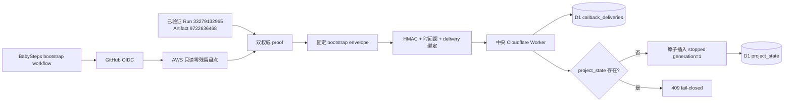
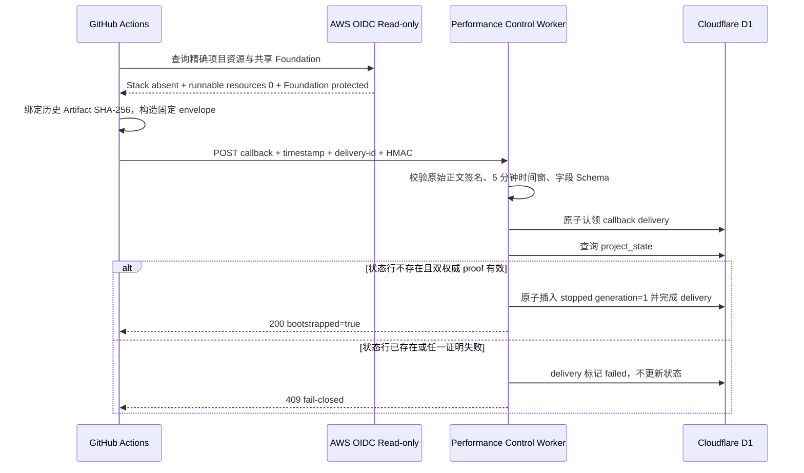

# 性能控制 stopped safety-bootstrap 合同

## 状态

- 中央 Worker：`verified-local`
- BabySteps 生产者合同：`verified-local`，commit `aff5328`
- GitHub Actions bootstrap dispatch：`pending`
- AWS Runtime：未启动
- Dashboard / Cloudflare 发布：冻结，等待样式确认与明确发布授权

本合同只解决中央 D1 尚无项目状态行时的安全初始化。它不能代替普通 `start` / `stop` 状态机，也不能把本地测试描述成云端完成。

## 固定协议

| 字段 | 固定要求 |
| --- | --- |
| `source` | `babysteps-performance-control-bootstrap-v1` |
| `operation` | `bootstrap-stopped-state` |
| `generation` | `1` |
| `status` | `stopped` |
| `bootstrapOnly` | `true` |
| `cleanupVerified` | `true` |
| `zeroResidualVerified` | `true` |
| 签名 | `HMAC-SHA256(timestamp + "." + exactRawBody)` |
| 防重放 | Header 与正文 `deliveryId` 一致；D1 delivery lease 原子认领 |
| D1 行条件 | 仅 `project_state` 不存在时允许插入；已有行固定拒绝 |

`proof` 必须精确包含 GitHub Actions Artifact 与当次 AWS OIDC 只读零残留回读：

- `authority=github-actions-artifact+aws-zero-residue-readback`
- 十进制 `workflowRunId` 与 `artifactId`
- 64 位小写十六进制 `evidenceSha256`
- `schemaAbsenceVerified=true`
- `cloudFormationStackAbsent=true`
- `remainingProjectResources=0`
- `sharedFoundationProtected=true`
- 禁止未知字段、快照载荷和弱化证明

## 架构

## 时序

## 本地验证

### BabySteps

- bootstrap 合同：`3/3`
- lifecycle 合同：`21/21`
- Sepolia 只读预检：`2/2`
- `pnpm check`、性能 pipeline / budget、delivery Evidence、public copy：通过
- 云状态：`cloud-not-dispatched`

### 中央 Worker

- TDD RED：新 source/字段被旧解析器拒绝；已有行会被旧逻辑错误应用
- TDD GREEN：专用 Schema、proof、缺失行插入和已有行拒绝均通过
- Worker 全量测试：`54/54`
- TypeScript `--noEmit`：通过
- 包声明的权威脚本为 `test`、`check-types` / `build`，均已通过
- 附加 Biome 审计发现既有全文件格式与未使用代码债务；它不是当前包声明的 Gate，本轮未大范围格式化或覆盖无关修改

## 生产边界

2026-08-30 只读回读仍显示：

- `controlState=unknown`
- `cleanupVerified=false`
- `snapshotAvailable=false`
- 快照端点 `404 verified_snapshot_not_found`

因此当前仍禁止开放 TOTP `start` / `stop`。此外，BabySteps 生产 Sepolia 当前没有未过期 active task；在用户可见钱包完成 provider 创建、owner 审批与 VRF 前，不允许 bootstrap dispatch、AWS Runtime 或新采样。GitHub App 安装范围也仍需具备相应身份的只读核验。

## 成本与安全

- 本轮无 AWS、Cloudflare、GitHub Actions 写操作。
- 不升级、不取消、不转换 AWS 或 Cloudflare 免费计划。
- bootstrap 只允许 OIDC 只读库存；任何预算、身份、证明或零残留 Gate 失败都必须停止。
