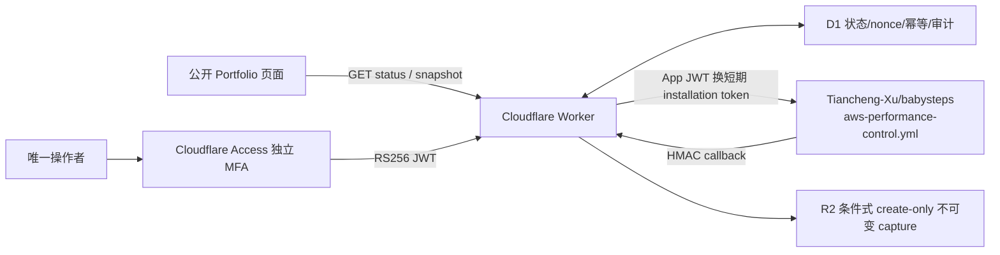
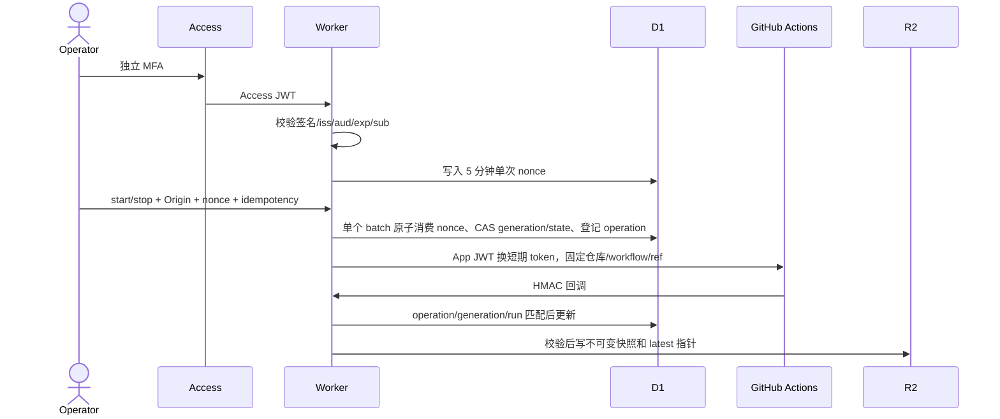

# 性能 MFA 控制面 Evidence

## 结论与证据边界

本地控制面实现已覆盖公开只读、Cloudflare Access JWT 独立校验、唯一 operator allowlist、同源、单次 nonce、幂等、固定 GitHub workflow、HMAC 回调、D1 状态与不可变 R2 快照。本文不证明 Cloudflare Access、GitHub App、D1/R2 或 AWS 生产闭环已经部署。

## 架构

## 控制时序

## 安全与故障关闭

- 公开 `status` 与 `snapshot` 不要求 MFA，且不返回操作者身份或秘密。
- `session/start/stop` 同时校验 Access RS256 签名、`iss`、`aud`、`exp`、`nbf`、`type=app`、exact email 与必需 exact `sub`；时钟偏差最多 60 秒，email/sub 原值不写 D1。
- 浏览器不能提交 repository、workflow、ref、AWS region、stack、TTL 或费用。
- 浏览器 start/stop 在单个 D1 batch 内完成 nonce 条件消费、旧 generation/state CAS 和 operation 插入；guard 失败会回滚整个 batch，不能消费 nonce 后漏记 operation，也不能只改状态后派发。
- workflow 失败、TTL 清理失败或回调失败进入 `cleanup_required`，禁止再次启动。
- R2 key 包含 operation、generation 和 content digest；`put` 使用 `onlyIf.etagDoesNotMatch="*"` 条件式 create-only，同摘要重试幂等，预条件冲突不可覆盖。D1 以 digest/state/event CAS 保存 latest key/digest，公开读取不信任可变 R2 pointer。
- callback 固定为 `https://baby2b.online/api/performance/control/callback`。
- callback 签名内容为 `timestamp.rawBody`，时间戳新鲜度最多 5 分钟；`occurredAt` 必须有限、位于合理窗口且严格晚于 `last_event_at`。最终 CAS 同时比较旧 state、operation、generation、workflow run、`updated_at` 与 `last_event_at`。
- `delivery_id` ledger 使用 `processing/applied/failed` lease，记录 `body_sha256`、`claimed_at`、`applied_at`、`attempts`。相同正文的 `applied` 为幂等 no-op；有效 lease 返回 409；过期 lease 或 `failed` 可 CAS 重试。普通 callback 与 bootstrap 都把 project state 应用、delivery finalize 和一致性 guard 放在同一个 D1 batch，任一步失败整批回滚后将 lease 置为可重试的 `failed`。
- D1 无状态行或读取异常时公开状态只能是 `unknown/unavailable/cleanupVerified=false`。只有 HMAC callback 明确携带 `zeroResidualVerified=true`，才允许初始化为 `stopped` 且清理已验证。
- 当前 `0001` 只保存 snapshot digest，没有可验证的 R2 object key；`0002` 不伪造 projection 指针，而是把公开 projection 明确设为 `unavailable`，并将旧 digest 保存在 `legacy_snapshot_sha256` audit 字段。迁移后 status 的 `snapshotAvailable=false`，snapshot endpoint 不会尝试读取不存在的对象。

## 成本与生命周期

- 最大运行时间：45 分钟。
- 预计增量费用上限：USD 0.20。
- 单项目、单实例；上一次 cleanup 未验证时拒绝启动。
- Cron 每 5 分钟处理过期运行并派发同一个固定 workflow 的 stop 动作。

## 必需变量名

普通变量：`CONTROL_ENABLED`、`CONTROL_ORIGIN`、`ACCESS_ISSUER`、`ACCESS_AUD`、`ACCESS_OPERATOR_SUB`、`GITHUB_APP_ID`、`GITHUB_APP_INSTALLATION_ID`。

Worker Secrets：`ACCESS_OPERATOR_EMAIL`、`GITHUB_APP_PRIVATE_KEY`、`CALLBACK_HMAC_SECRET`。

Bindings：`CONTROL_DB`、`SNAPSHOTS`。

## 限制与待补验

- Worker 每次控制操作现场签发最长 9 分钟的 GitHub App JWT，并交换短期 installation token；仓库不保存 installation token。
- 生产配置生成器默认与 CI 均输出 `CONTROL_ENABLED=false`。只有显式 `--enable-control` 且 production origin、真实 D1/R2、Access 与 GitHub App 标识全部通过校验时才输出 `true`。
- 本地测试不能证明 Access 独立 MFA policy 已启用，也不能证明 GitHub App 安装范围、D1/R2 binding 或回调网络路径正确。
- 未经生产授权不得部署、派发 workflow 或改变 Cloudflare/GitHub/AWS 状态。
