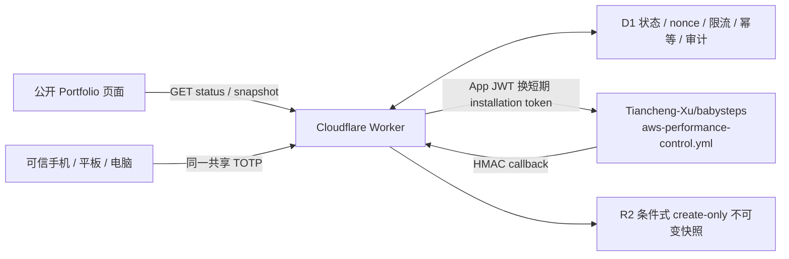
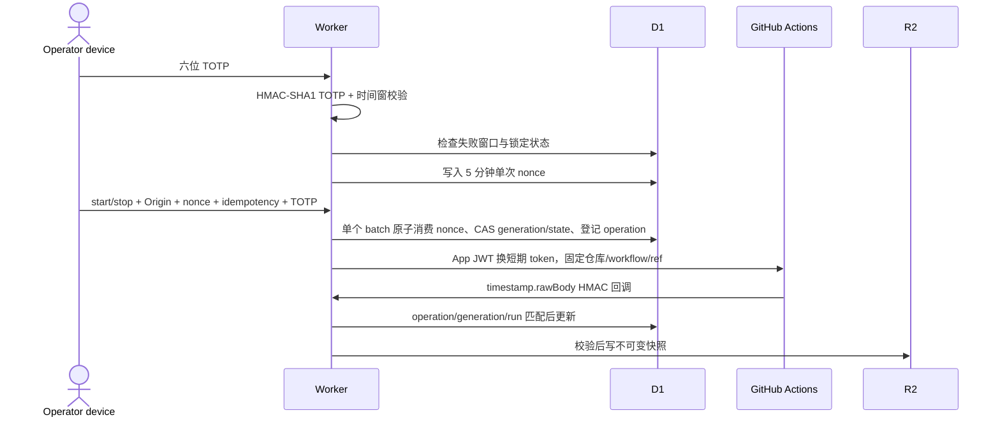

# 性能 TOTP 控制面 Evidence

## 结论与证据边界

控制面已实现公开只读、共享 TOTP、多设备注册、失败锁定、同源、单次 nonce、幂等、固定 GitHub workflow、HMAC 回调、D1 状态与不可变 R2 快照。Cloudflare 上的 D1/R2、三个秘密名称和禁用态 Worker 已核对；本文暂不声称真实 GitHub 调度或 AWS 启停闭环完成。

## 架构

## 控制时序

## 安全与故障关闭

- 公开 `status` 与 `snapshot` 不要求 TOTP，且不返回操作者信息或秘密。
- `session/start/stop` 验证共享 TOTP；同一 secret 可录入多个可信设备，但所有设备属于同一审计主体，不能区分个人。
- 五分钟内五次失败会锁定十分钟；D1 限流状态不可用时返回 `503`。
- 浏览器不能提交 repository、workflow、ref、AWS region、stack、TTL 或费用。
- start/stop 在单个 D1 batch 内完成 nonce 条件消费、旧 generation/state CAS、operation 插入和一致性 guard。
- GitHub workflow 失败、TTL 清理失败或回调失败进入 `cleanup_required`，禁止再次启动。
- R2 key 包含 operation、generation 和 content digest；条件式 create-only，不能覆盖已有快照。
- callback 固定为 `https://baby2b.online/api/performance/control/callback`，签名内容为 `timestamp.rawBody`，新鲜度最多五分钟。
- D1 无状态行时公开状态只能是 `unknown/unavailable/cleanupVerified=false`。只有带 `zeroResidualVerified=true` 的 HMAC 安全回调可初始化为 `stopped`。

## 成本与生命周期

- 最大运行时间：45 分钟。
- 预计增量费用上限：USD 0.20。
- 单项目、单实例；上一次 cleanup 未验证时拒绝启动。
- Cron 每五分钟处理过期运行并派发固定 stop 动作。
- 当前未启动 AWS 资源，未升级 AWS 或 Cloudflare 套餐。

## 必需配置

普通变量：`CONTROL_ENABLED`、`CONTROL_ORIGIN`、`GITHUB_APP_ID`、`GITHUB_APP_INSTALLATION_ID`。

Worker Secrets：`TOTP_SECRET`、`GITHUB_APP_PRIVATE_KEY`、`CALLBACK_HMAC_SECRET`。

Bindings：`CONTROL_DB`、`SNAPSHOTS`。

## 已核对与待补验

- 已核对：D1 `baby2b-performance-control` 的 0001-0003 迁移与九张表；R2 `baby2b-performance-snapshots`；三个 Worker secret 名称；生产 Worker 保持 `CONTROL_ENABLED=false`。
- 待补验：真实 GitHub App ID、Installation ID 和私钥组合；AWS OIDC 零残留 bootstrap；TOTP session/start/stop；HMAC callback；R2 v2 快照；TTL 自动停止；生产页面真实图表。

## 2026-08-30 生产只读复核

- 生产控制页 `https://baby2b.online/performance-control/babysteps/` 在 390 与 1440 视口均返回 HTTP 200；TOTP 输入存在，启动和安全停止按钮均保持禁用，根级横向溢出为 0，浏览器 `pageerror` 为 0。
- 公开状态接口返回 `controlState=unknown`、`dataMode=unavailable`、`cleanupVerified=false`、`snapshotAvailable=false`；快照接口返回 `verified_snapshot_not_found`，未知项目返回 404。该结果证明失败关闭，不证明控制闭环已经上线。
- 本地 Worker 安全合同 52/52 通过，TypeScript 检查通过；其中包含两个独立可信设备复用同一共享 TOTP、分别获得不同短期 nonce 的直接回归，禁用态生成配置仍为 `CONTROL_ENABLED=false`。
- GitHub App 公开页 `https://github.com/apps/baby2b-performance-control` 返回 HTTP 200，应用名称为 `Baby2B Performance Control`；实际 Installation 目标、当前权限和 Worker 中的 App ID/Installation ID 组合仍需通过受保护账户状态补验，公开页面不能替代安装证明。
- BabySteps 固定工作流包含 GitHub Environment、OIDC、USD 0.20 上限、45 分钟 TTL、双定时停机、HMAC 回调、不可变快照、Schema 清理与 12 类项目资源零残留检查。
- 当前安全 bootstrap 仍有缺口：固定 `preflight` 会验证 OIDC 与项目零残留，但尚未向无状态的中央 D1 发布专用 `stopped + cleanupVerified + zeroResidualVerified` 初始化回调，因此生产状态仍不能安全进入可启动状态。
- Worker 默认域名硬化补丁 PR #25 已通过远端 Gate，但尚未合并到主分支；本地候选已同步 `workers_dev=false` 与 `preview_urls=false`，Worker 52/52 和类型检查通过。重新部署前仍必须先将该补丁正式纳入主分支，避免默认域名重新暴露。
- 本轮未执行 AWS、Cloudflare 或 GitHub 写操作；AWS CLI 会话与 Cloudflare 非交互 Token 均不可用，因此账户预算、实时 OIDC/IAM、Worker 变量和 D1/R2 库存仍标记为待补验。
