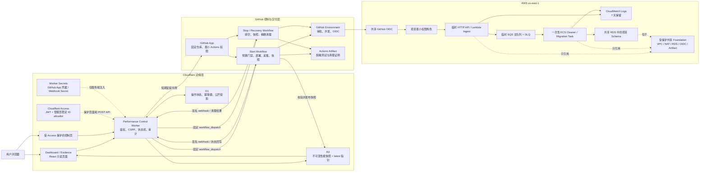
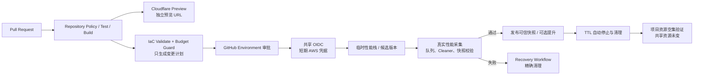
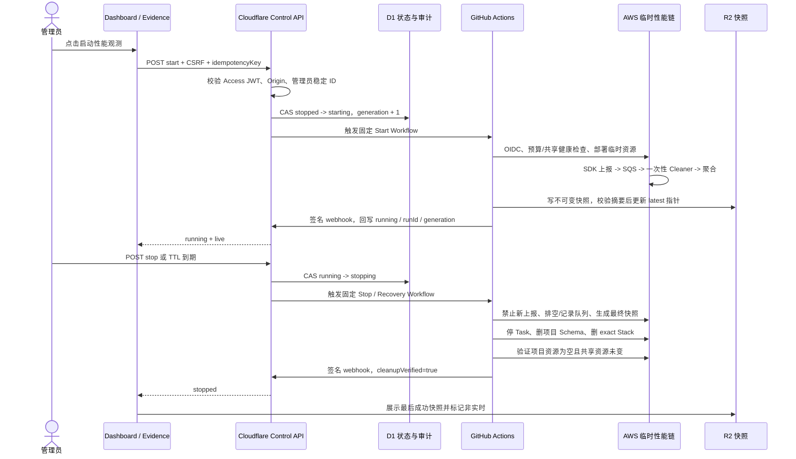

# 性能观测与成本控制 Evidence

> 认证方案更新：本文保留早期 Cloudflare Access/JWT 设计讨论，不能作为当前控制认证实现的证明。当前实现以共享 RFC 6238 TOTP、多设备注册、失败锁定、单次 nonce 和同源校验为准，权威边界见 `performance-mfa-control-evidence.md`。在安全 bootstrap、真实 GitHub App dispatch、TOTP start/stop、HMAC 回调、R2 快照和 TTL 停机完成同一轮生产闭环前，中央控制面不得标记为已上线。
>
> 状态：本地页面、D1 状态机、R2 快照契约和公开只读 Worker 已实现；BabySteps AWS 临时性能链已通过 Run 32917816824 完成一次真实云端闭环并精确清理。固定启停控制、Cloudflare Access 和 GitHub App 回调尚未上线，控制写入口继续失败关闭。

## 1. 目标与验收边界

本功能解决两个问题：

1. AWS 性能观测链停止、故障或正在清理时，Dashboard 和 Evidence 仍展示最后一次校验通过的性能快照，并明确标记“历史数据 · 当前非实时”；
2. Dashboard 和 Evidence 都提供同一个受保护的启停入口，让管理员只执行“启动本项目性能观测”和“停止并精确清理”两个固定动作，控制作业成本。

它不是通用 AWS 管理控制台。浏览器不接触 AWS 凭据、GitHub App 私钥或长期 Token，也不能输入任意仓库、工作流、Stack 名称或资源 ARN。

## 2. 作业要求到证据的映射

| 作业要求 | 实现功能 | 代码位置 | 验证证据 | 当前状态 |
| --- | --- | --- | --- | --- |
| 性能 SDK 数据可视化 | 统一的实时、历史、不可用三态数据模型与指标卡 | `apps/web/apps/web/src/features/performance/performance-types.ts`、`performance-state.ts`、`performance-status-card.tsx` | 状态/快照单元测试；Web 全量测试通过 | 本地已实现 |
| AWS 停止时保留上次结果 | 仅展示校验通过的最后快照；无快照时显示可信空状态，不生成假数据 | `apps/web/apps/web/src/features/performance/performance-state.ts` | 非法时间、提交哈希、摘要、样本率、指标顺序的拒绝测试 | 本地已实现 |
| Dashboard 与 Evidence 都有成本入口 | 两页复用同一状态卡并链接到单一受保护控制面 | `dashboard-content.tsx`、`evidence-content.tsx`、`performance-control-content.tsx` | 组件与页面集成测试 | 本地已实现；云端控制未部署 |
| 完整架构与流程说明 | 运行架构、Actions/预览/灰度、启停时序、信任与费用边界 | `performance-evidence-diagrams.tsx`、本文 | Evidence 页面集成测试；本文版本记录 | 本地已实现 |
| Cloudflare 状态与快照接口 | D1 状态/审计、R2 不可变快照、摘要校验、ETag 与失败关闭写入口 | `apps/web/apps/performance-control-worker/src/`、`migrations/0001_performance_control.sql` | Worker 3 个测试文件、13 个测试通过；类型检查通过 | 本地已实现 |
| GitHub Actions + AWS + Cloudflare 控制 | Access 保护控制面，GitHub App 触发固定工作流，OIDC 获取短期 AWS 身份 | 本文第 4、5、6 节；云端实现待接入 | 尚无本项目真实云端闭环 Run | 设计已确认，未部署 |
| 费用可控且不破坏共享资源 | 临时资源按项目前缀清理；复用共享 VPC/NAT/RDS/OIDC；共享资源显式保护 | 本文第 8、9 节 | 已核实共享基础设施清单；真实清理证据待运行 | 设计已确认 |

## 3. 当前可验证结果

| 验证项 | 观察结果 |
| --- | --- |
| Web 单元/集成测试 | 6 个测试文件、15 个测试通过 |
| Web 构建与类型检查 | Vite 构建和 TypeScript 检查通过 |
| Worker 状态机、快照与只读 API | 3 个测试文件、13 个测试通过；TypeScript 检查通过 |
| Worker 写入口安全状态 | 无论单个环境变量如何配置，当前 POST 控制入口均失败关闭并返回 503 |
| 页面数据真实性 | 无可信实时数据和无可信快照时显示空状态，不回退到示例指标 |
| 控制按钮 | 在云端控制未部署前保持禁用，并显示“云端控制尚未部署” |
| 响应式与可访问性检查 | 390 px 与 1440 px 视口均无横向溢出；Evidence 返回入口最小高度为 44 px |
| 公开内容安全检查 | 页面源码与公开 Evidence 未发现 AWS 账号 ID、访问密钥、私钥、NAT/VPC 实例 ID 或本机绝对路径 |
| 对话设计收录 | 本轮确认的运行架构、控制时序、费用取舍、安全边界和非目标已归并到第 4—13 节 |
| 云端启停闭环 | 尚未执行；不得标记为完成 |

## 4. 运行架构



### 看哪里

- 浏览器只接触 Cloudflare 页面和控制 API；
- Cloudflare Worker 通过 GitHub App 触发固定工作流，不直接持有 AWS 长期凭据；
- GitHub Actions 通过共享 OIDC 获取短期项目角色；
- AWS 临时资源复用共享 Foundation，清理只针对项目前缀和项目标签；
- 停止 AWS 后，Dashboard/Evidence 从 R2 读取最后一份可信快照。

### 证明什么

该设计把公开读、管理员控制、部署身份、运行数据和共享基础设施分开，既保留可验证性能数据，又缩短 AWS 付费资源的运行时间。

## 5. GitHub Actions、预览环境与灰度发布



发布约束：

- PR 预览只用于 UI、契约和构建验证，不默认创建长期 AWS 环境；
- AWS 候选环境必须先通过预算扫描和 Environment 门禁；
- 工作流并发键固定为 `performance-<projectSlug>`，清理不能被新启动取消；
- 灰度含义是先在临时性能链执行真实采集与故障验证，再发布快照或提升，不把未验证候选直接当生产结果；
- PR 关闭、管理员停止或 TTL 到期都会进入同一条精确清理链。

## 6. 启动、采集与停止时序



### 有意义的配置步骤

1. 在固定项目注册表定义仓库、Environment、Start/Stop Workflow、Stack 前缀和最大运行时长；客户端不能覆盖这些值。
2. Cloudflare Access 同时保护控制页和 POST API；Worker 验证 `iss`、`aud`、`exp`、Origin、CSRF 和管理员稳定 ID。
3. D1 为每个项目保存 `controlState`、`dataMode`、`generation`、`operationId` 和幂等键；Webhook 只有在 operation、generation、runId 全匹配时才允许推进状态。
4. GitHub App 只触发注册表中的固定工作流；GitHub Environment 负责审批、并发和 OIDC 身份边界。
5. Start Workflow 先验证上次 cleanup 已完成、项目资源与 Schema 为空，再创建临时链。
6. 快照先做 Schema、敏感字段和 SHA-256 校验，成功后才更新 `latest` 指针；旧快照不可覆盖。
7. Stop Workflow 先禁止新上报，记录主队列/DLQ 数量和最终快照，再停止任务、删除项目 Schema/Stack，并验证空集。
8. Cloudflare Cron 定期对照 D1、GitHub Run 和 AWS 只读状态，处理超时、孤儿运行和 TTL 自动停止。

其中第 1、3、6 项的数据契约、状态机、公开只读接口与失败关闭写入口已经在本地 Worker 落地；第 2、4、5、7、8 项涉及 Access、GitHub App、Actions 或真实 AWS 状态，当前仍是已确认设计，必须等真实部署和 Run 证据后才能改成完成。

## 7. 状态、审计与快照契约

### 7.1 两组正交状态

`controlState` 表示资源生命周期：

```text
stopped -> starting -> running -> stopping -> stopped
                     \-> failed <-/
```

`dataMode` 表示页面展示的数据来源：

```text
live | historical | unavailable
```

二者不能混为一谈。例如 AWS 已停止时，`controlState=stopped`，但只要最后快照通过校验，`dataMode=historical`。

### 7.2 D1 最小记录

```text
project_state(projectSlug, controlState, dataMode, generation,
              operationId, workflowRunId, expiresAt, updatedAt)
operations(operationId, projectSlug, action, idempotencyKey,
           generation, workflowRunId, result, cleanupVerified,
           requestedAt, completedAt)
```

- `(projectSlug, idempotencyKey)` 唯一，防止双击/重试重复创建；
- webhook 使用 `operationId + generation + workflowRunId` 做比较并交换；
- 公开投影不包含管理员邮箱、Access 身份、私有日志 URL 或 Token。

### 7.3 R2 不可变快照

```text
snapshots/<projectSlug>/<captureId>.json
snapshots/<projectSlug>/latest.json
```

快照至少包含：`captureId`、窗口类型、仓库、完整提交 SHA、工作流 Run、SDK/Cleaner 版本、百分位算法、采样率、指标名称与单位、页面/路由、样本数、p50/p75/p95、错误数、Schema 版本和内容摘要。

规则：

- 不允许覆盖已有 `captureId`；
- 校验、脱敏和摘要计算全部通过后，才更新 `latest.json`；
- D1 保存受信摘要，读取时再次核对；
- 单个 LCP 样本只能标为“合成闭环样本”，不能包装成生产趋势；
- 快照禁止包含 Cookie、Token、请求正文、IP、钱包地址、用户标识和原始堆栈；
- 没有可信快照时显示“暂无可信性能数据”，绝不生成占位假指标。

## 8. 权限、网络与安全边界

| 主体 | 允许 | 明确禁止 |
| --- | --- | --- |
| 浏览器 | 公开读状态/快照；登录后请求固定启停 | AWS/GitHub 凭据；任意工作流/资源参数 |
| Cloudflare Worker | Access 校验、D1/R2、GitHub App 短期令牌、固定 dispatch | 长期 PAT；通用 AWS 管理；任意仓库/分支 |
| GitHub App | 目标仓库 Actions 写、Contents 只读、Metadata 只读 | 访问未注册仓库；修改产品源码 |
| GitHub OIDC 项目角色 | 固定项目前缀临时资源；读取共享输出和必要 Secret | 长期 Key；删除/修改共享基础设施 |
| CloudFormation 执行角色 | 仅项目 Stack 和精确资源前缀 | 共享 VPC/NAT/RDS/ALB/OIDC 删除 |
| 公共 Evidence | 脱敏状态、指标、摘要、公开 Run 证明 | 管理员身份、私有日志、密钥、内部路径 |

控制页和 POST API 必须同时受 Cloudflare Access 保护。只给页面加登录而让 API 裸露不算完成。Webhook 必须校验 HMAC；状态接口支持 ETag 和退避，避免页面轮询放大 GitHub/AWS 请求。

## 9. 费用、复用与清理责任

### 9.1 共享基础设施复用矩阵

| 能力 | 处理方式 | 增量费用/配额影响 |
| --- | --- | --- |
| VPC、私有子网 | 复用 `tc-course-shared-foundation` | 不新增 VPC/子网 |
| NAT Gateway | 复用共享 NAT，只承担运行期少量流量 | 不新增 NAT 固定费 |
| PostgreSQL | 复用 `tc-shared-course-postgres`，项目独立 Schema/Role | 不新增实例；占用少量存储/连接 |
| GitHub OIDC | 复用账户级 Provider，项目使用独立最小权限 Role | 不新增 Provider |
| Artifact/日志基础 | 复用受保护 Foundation；项目日志短保留 | 少量存储 |
| SQS/DLQ、ECR、API/Lambda | 项目临时资源 | 按请求和短期镜像存储 |
| ECS Cleaner/Migration | 一次性 Task，不建常驻 Service | 仅执行分钟数 |
| Cloudflare Worker/D1/R2 | 免费额度优先 | 超出免费额度才计费 |

共享 Foundation 的具体账号、子网和资源 ID 只保存在受控私有盘点中，公开 Evidence 仅保留可理解的逻辑名称。

### 9.2 清理负责人和保护清单

- 清理负责人：项目固定 Stop/Recovery Workflow；超时由 Cloudflare Cron/TTL 触发同一工作流；
- 项目清理目标：精确项目前缀的 ECS Task/Cluster、ECR、SQS/DLQ、Lambda/API、Security Group、短期日志、项目 Secret 和项目 DB Schema/Role；
- 保护清单：共享 VPC、NAT、RDS 实例、共享 ALB、共享 ECS Cluster、GitHub OIDC、共享 Artifact Bucket、共享 IAM/Foundation Stack；
- 删除必须同时满足 exact Stack/前缀和项目标签；共享资源只读核验并由显式 Deny 保护；
- cleanup 完成条件不是“命令成功”，而是项目资源空集、项目 Schema/Role 不存在、共享资源仍健康且未改变。

## 10. 明确不做及原因

| 方案 | 本阶段不采用的原因 | 当前替代方案 |
| --- | --- | --- |
| Athena / Glue / Firehose | 作业数据量很小，引入目录、流式投递和查询层会增加费用、权限面、配额和清理复杂度，不能带来相称收益 | SQS + 一次性 ECS Cleaner + 项目 Schema/快照 |
| 常驻 ECS Service | 为偶发作业采集持续付费，停止语义也会变模糊 | 按需 RunTask，采集结束立即停止 |
| 每项目一套 OAuth/OIDC Provider | 重复 Provider 增加信任策略、配额和维护面，且不提升项目隔离 | 复用账户级 OIDC，每项目独立 Environment 和最小权限 Role |
| 通用 AWS 管理控制台 | 浏览器获得过大操作能力，误删共享资源风险高，难以审计固定作业流程 | 只开放“启动”和“停止并清理”两个固定动作 |
| AI Agent 自动删除或重放资源 | 删除和重放会改变真实云状态；模型判断不适合作为不可逆操作的唯一授权 | 固定工作流、预算/身份/资源 Gate、人工确认和可恢复幂等操作 |

这些能力不是永远禁止。只有在数据规模、查询频率、业务目标或人工成本提供了可验证收益，并完成新的费用/权限/清理评估后，才进入下一版设计。

## 11. 故障与恢复证据要求

真实云端闭环必须至少留下以下脱敏证明：

1. 一次启动成功：预算 Gate、共享健康检查、临时资源清单和首轮可信快照；
2. 一次 DLQ 故障注入：失败重试、DLQ 深度告警、受控 redrive、消费幂等；
3. 一次实时 API 故障：页面保留上次可信指标并切换为“历史数据 · 当前非实时”；
4. 一次停止/TTL：禁用入口、排空记录、最终快照、项目资源空集和共享资源未变；
5. 每张截图记录“看哪里”和“证明什么”，并在清单中保存文件名、字节数和 SHA-256。

当前尚未完成真实云端闭环，因此上述五项不能标为已完成。

## 12. Evidence 更新规则

- 设计改变时同时更新本文、Evidence 页面图和状态卡契约；
- 云端每个关键节点完成后追加真实 Run ID、提交 SHA、资源清单、测试结果和脱敏截图摘要；
- 不记录登录跳转、远程连接、生成 Evidence 失败等与项目能力无关的排障噪音；
- 不用计划、mock、示例数字或同学项目截图冒充本项目证明；
- 公开发布前执行敏感内容扫描、链接检查、响应式检查，并核对架构图与真实资源一致。

## 13. 对话设计决策收录清单

本节用于确认对话中形成的项目设计没有只停留在聊天记录。重复表述会合并，且只收录与产品行为、架构、权限、成本、验证或生命周期有关的决策。

| 对话中确认的设计 | Evidence 落点 | 当前证据状态 |
| --- | --- | --- |
| AWS 停止或故障时展示最后一次可信性能结果 | 第 1、4、6、7 节；Dashboard/Evidence 共用状态卡 | 本地已实现 |
| Dashboard 与 Evidence 都提供启停入口，但只维护一个受保护控制面 | 第 1、4、8 节；`performance-control-content.tsx` | 本地入口已实现；云端鉴权未部署 |
| D1 是操作和审计权威状态，使用 generation、幂等键与 CAS | 第 4、6、7 节；`state-machine.ts`、D1 migration | 本地已实现 |
| R2 使用不可变 captureId 对象和 latest 指针，读取时复核 SHA-256 | 第 4、6、7 节；`snapshot.ts`、`worker.ts` | 本地已实现 |
| controlState 与 dataMode 正交，停服不等于没有历史数据 | 第 7 节；`performance-state.ts` | 本地已实现 |
| Cron 处理 TTL、超时和孤儿运行；Webhook 只能按 operationId + generation + runId 推进状态 | 第 5、6、7 节 | 状态机本地实现；Cron/Webhook 云端未部署 |
| GitHub App 只能派发固定工作流；AWS 通过共享 OIDC 获取短期项目角色 | 第 4、5、8 节 | 设计已确认；云端未部署 |
| 启动前验证 cleanupVerified 与资源空集；停止按封入口、排空、快照、清理、空集验证执行 | 第 6、9 节 | 设计已确认；真实闭环待运行 |
| 快照必须包含来源、版本、采样、百分位、样本和摘要；单样本不能冒充生产趋势 | 第 5、7、11 节 | 契约本地已实现；真实数据待运行 |
| DLQ 故障注入、告警、受控 redrive 与消费幂等必须形成证明 | 第 11 节 | 未执行 |
| 复用共享 VPC/NAT/RDS/OIDC，不创建每项目长期基础设施 | 第 8、9 节 | 共享底座已核实；项目部署待运行 |
| 不采用 Athena/Glue/Firehose、常驻 ECS、每项目 OAuth/OIDC、通用 AWS 控制台和 AI 自动删除/重放 | 第 10 节 | 决策与原因已记录 |
| Evidence 只保留有意义步骤，排除登录、远程连接及 Evidence 工具自身排障 | 第 12 节 | 文档规则已落实 |
| 每次设计调整都必须同步更新项目 Evidence，而不是只保留在聊天记录 | 第 12、13 节 | 已建立收录清单；后续随实现持续维护 |

## 14. 2026-08-26 真实 AWS 闭环

- GitHub Actions：[Run 32917816824](https://github.com/Tiancheng-Xu/babysteps/actions/runs/32917816824)，提交 `b23894d4704eb60dc85c782ea7d9af8edeb2d135`，区域 `us-east-1`。
- 临时资源：CloudFormation 创建 21 个项目资源，包含 HTTP API、2 个 Lambda、SQS/DLQ、ECR、ECS Cluster/Task Definition、日志组、项目 Secret、安全组与最小权限角色。
- 真实数据链：接收 1 条受控 LCP 事件；ECS Cleaner `exitCode=0`；查询结果为 `sampleCount=1`、`p50=321ms`、`p75=321ms`、`p95=321ms`、`errorRate=0`。
- 精确清理：项目 Schema 第一次删除成功；项目 Stack 删除成功；剩余项目 ECS Cluster 为 0；共享 Foundation 保持受保护。
- 证据边界：该结果证明临时链路和清理生命周期可运行，不证明长期生产流量规模，也不表示固定启停控制已经上线。生产页只能把它展示为 `synthetic-closed-loop` 历史快照。
