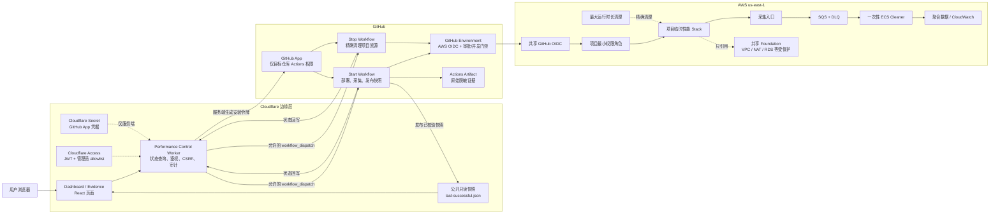
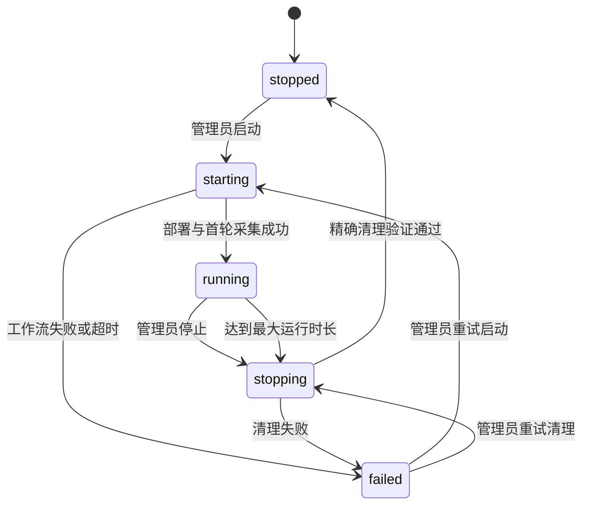
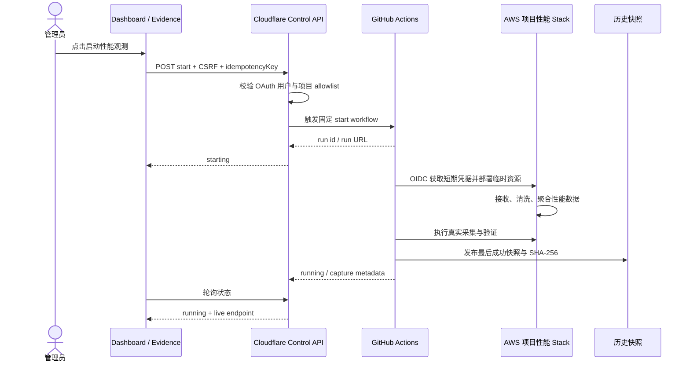
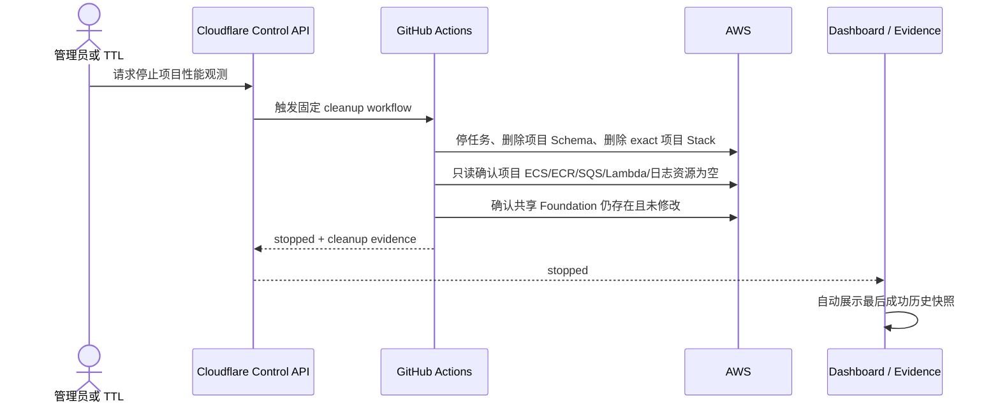

# 性能观测直接控制与历史快照兜底设计

日期：2026-08-14

状态：用户已确认，进入实现

首个接入项目：BabySteps

适用范围：所有已经实现 AWS 性能观测链路的课程项目

## 1. 目标

在项目 Dashboard 和 Evidence 页面同时提供安全、可审计的性能观测控制入口：

1. 管理员可以在页面中直接启动或停止该项目的 AWS 性能观测临时资源；
2. 浏览器不接触 AWS 凭据、GitHub App 私钥或长期访问令牌；
3. AWS 性能链停止、故障或正在清理时，页面展示最近一次真实成功采集的性能快照；
4. 历史快照必须明确标记为“历史数据，当前非实时”，展示采集时间、提交、工作流和校验摘要；
5. 每次启动、停止、失败、超时清理都形成可追溯记录；
6. 只创建和清理项目自己的临时资源，不删除共享 VPC、NAT、RDS、ALB、OIDC 或共享日志基础设施。

这不是一个通用 AWS 控制台。页面只提供两个受约束动作：启动该项目性能观测、停止该项目性能观测。

## 2. 非目标

- 不允许浏览器直接调用 AWS API；
- 不允许从页面执行任意工作流、任意分支或任意 Stack 名称；
- 不创建新的 NAT、RDS、ALB、OIDC Provider 等共享付费基础设施；
- 不在公开 Evidence 中展示密钥、Cookie、私有路径、原始日志或个人信息；
- 不把历史快照伪装为实时数据；
- 不把远程连接排障、Evidence 生成排障等无关过程写入项目 Evidence。

## 3. 用户体验

### 3.1 公共访问

所有访客都能查看：

- 当前观测状态：启动中、运行中、停止中、已停止、失败；
- 当前为实时数据还是历史快照；
- 最近成功采集时间、样本数、关键指标和来源提交；
- 最近一次公开且脱敏的执行结果。

未登录用户点击控制区时，只能进入“管理员登录”，不能触发变更。

### 3.2 管理员访问

管理员通过 Cloudflare Access 登录。控制 Worker 校验 Access JWT 的签发者、受众、有效期和管理员身份 allowlist 后，显示：

- `启动性能观测`；
- `停止并清理性能观测`；
- 当前操作阶段和 GitHub Actions 执行链接；
- 自动停止剩余时间；
- 最近一次操作的执行者、时间和结果。

启动或停止后，按钮进入不可重复提交状态，直到后端确认新状态或超时。

### 3.3 历史快照兜底

Dashboard 优先读取实时查询 API。出现超时、5xx、资源已停止或状态明确为 stopped 时，读取同项目的最后成功快照。

展示规则：

- 实时数据：绿色“实时”标记；
- 历史快照：琥珀色“历史数据 · 当前非实时”标记；
- 快照损坏或从未成功采集：显示“暂无可信性能数据”，不得回退到示例数据；
- 页面必须展示 `capturedAt`、`sourceCommit`、`sourceRunUrl`、`sampleCount` 和 `snapshotSha256`。

## 4. 运行架构



### 4.1 信任边界

| 边界 | 允许 | 禁止 |
| --- | --- | --- |
| 浏览器 | 查看公开状态、发起已登录的启停请求 | AWS 凭据、GitHub App 私钥、任意 workflow 参数 |
| Cloudflare 控制 API | 校验管理员、生成短期 GitHub App 安装令牌、触发固定工作流 | 保存长期 PAT、拼接任意仓库/分支/Stack |
| GitHub Actions | 通过 Environment 和 OIDC 获取短期 AWS 凭据 | 长期 AWS Key、越过项目资源前缀 |
| AWS 项目角色 | 管理固定项目前缀的临时性能资源、读取共享输出 | 删除或修改共享 VPC/NAT/RDS/ALB/OIDC |
| 公共快照 | 脱敏指标、来源和哈希 | Cookie、Token、请求正文、用户标识、原始堆栈 |

## 5. 控制协议

Cloudflare 控制 API 使用固定项目注册表，不接受客户端提供仓库、工作流文件、AWS Stack 或资源 ARN。

首个 BabySteps 注册项：

```text
projectSlug: babysteps
repository: Tiancheng-Xu/babysteps
environment: aws-performance
startWorkflow: aws-performance.yml
stopWorkflow: aws-performance-recovery.yml
awsStackPrefix: babysteps-performance-
maxRuntimeMinutes: 60
```

接口：

```text
GET  /api/performance/control/status?project=babysteps
POST /api/performance/control/start
POST /api/performance/control/stop
GET  /api/performance/snapshot?project=babysteps
```

变更请求只接受 `{ projectSlug, idempotencyKey }`。服务端自行解析全部资源和工作流信息。

安全要求：

- Cloudflare Access 同时保护控制页面和 POST API；Worker 必须校验 JWT 的 `iss`、`aud`、`exp` 与管理员身份 allowlist；
- POST 必须通过 Origin、CSRF 和会话校验；
- 管理员以不可变 GitHub user ID allowlist 判断，不只比较用户名；
- 每个项目同一时刻只允许一个控制操作；
- `idempotencyKey` 防止双击和网络重试重复启动；
- IP + 用户 + 项目三级限流；
- GitHub App 只安装到目标仓库，仅授予 Actions 写入、Contents 只读和 Metadata 只读权限，用于触发固定工作流并核对来源提交；
- 所有服务端日志执行敏感字段过滤。

## 6. 状态机



状态来源优先级：

1. GitHub Actions 当前执行；
2. 最近完成执行的结论；
3. AWS 只读资源盘点；
4. 缓存状态。

缓存状态不能覆盖 GitHub/AWS 的更新事实。超过 2 分钟未确认时标记为“状态待核实”，而不是武断显示运行中。

## 7. 启动时序



## 8. 停止与自动清理时序



## 9. 快照契约

公开快照是经过校验和脱敏的构建产物：

```json
{
  "schemaVersion": 1,
  "projectSlug": "babysteps",
  "mode": "historical",
  "capturedAt": "2026-08-14T00:00:00Z",
  "sourceCommit": "full-commit-sha",
  "sourceRunUrl": "https://github.com/Tiancheng-Xu/babysteps/actions/runs/00000000000",
  "sampleCount": 1,
  "metrics": {
    "lcpMs": 321,
    "p50Ms": 321,
    "p75Ms": 321,
    "p95Ms": 321,
    "errorRate": 0
  },
  "snapshotSha256": "sha256-of-canonical-payload"
}
```

约束：

- `sourceCommit` 必须为完整提交哈希；
- `sourceRunUrl` 必须属于注册仓库；
- 指标必须为有限非负数并符合各指标单位；
- 哈希校验失败则整份快照不可展示；
- 快照不包含原始事件、IP、User-Agent、钱包、Cookie、Token 或请求正文；
- Snapshot 的发布与项目部署解耦，停止 AWS 资源不会删除快照。

## 10. Dashboard 与 Evidence 接入

### 10.1 共享组件

两个页面复用相同的只读数据模型和控制组件：

- `PerformanceModeBadge`：实时、历史、不可用；
- `PerformanceControlPanel`：登录、启停、状态、TTL；
- `PerformanceSnapshotMeta`：采集时间、提交、Run、样本、哈希；
- `PerformanceMetrics`：指标卡和图表；
- `PerformanceAuditTrail`：最近的脱敏操作记录。

### 10.2 Dashboard

- 运行中每 10 秒轮询实时 API；
- 实时请求失败立即尝试历史快照；
- 不因一次错误清空已展示的可信数据；
- 页面恢复可见时重新核实状态；
- 停止状态不继续轮询 AWS 实时 API。

### 10.3 Evidence

Evidence 除上述组件外，还必须包含：

- `作业要求 -> 实现功能 -> 代码位置 -> 验证证据 -> 当前状态`；
- 完整运行架构图、启动/停止时序图；
- GitHub Actions、OIDC、Environment、临时资源与精确清理说明；
- 成本与复用矩阵；
- 一次真实启动、采集、停止、清理的脱敏证明；
- 每张证据图的“看哪里”和“证明什么”。

## 11. AWS 成本与资源边界

BabySteps 首轮复用：

| 能力 | 处理方式 | 是否新增长期费用 |
| --- | --- | --- |
| VPC / 私有子网 | 复用 `tc-course-shared-foundation` | 否 |
| NAT Gateway | 复用共享 NAT，仅在运行时产生少量流量 | 否（不新增 NAT） |
| RDS PostgreSQL | 复用共享实例，使用项目 Schema | 否（不新增实例） |
| GitHub OIDC | 复用账户 OIDC Provider | 否 |
| SQS / DLQ | 项目临时资源 | 按请求，作业量级接近零 |
| ECR | 项目临时仓库，生命周期清理 | 短期镜像存储 |
| ECS | 仅一次性 Cleaner/迁移任务，不建常驻 Service | 仅运行分钟数 |
| Lambda / API Gateway | 项目临时入口 | 按请求 |
| CloudWatch Logs | 7 天保留并随项目清理 | 少量短期存储 |
| 控制 API | Cloudflare Worker 免费额度优先 | 预计无新增费用 |

保护清单：共享 VPC、NAT Gateway、RDS 实例、共享 ALB、共享 ECS Cluster、GitHub OIDC Provider、共享 Artifact Bucket、共享 IAM Foundation Stack。

任何 cleanup 工作流必须同时满足项目资源名前缀和项目标签；共享资源只允许 Describe/读取输出，显式拒绝删除。

## 12. GitHub Actions 生命周期

### 12.1 启动工作流

1. 验证调用来源、Environment、预算门禁和共享 Foundation 健康状态；
2. 构建项目 Cleaner 镜像并推送精确项目前缀 ECR；
3. 部署项目临时 Stack；
4. 执行 Schema 初始化和真实性能采集；
5. 生成并校验快照、报告、资源清单和哈希；
6. 发布公开快照并上传私有 Actions Artifact；
7. 设置最大运行时长清理计划；
8. 失败时执行精确回滚与资源空集验证。

### 12.2 停止工作流

1. 按项目 run/stack ID 解析 exact targets；
2. 停止项目 ECS Task；
3. 删除项目 Schema 和项目 Stack；
4. 只读核对项目 ECS/ECR/SQS/Lambda/API/log/secret/SG 是否清空；
5. 只读核对共享资源仍存在；
6. 上传清理证明并回写 stopped 状态。

### 12.3 并发与恢复

- GitHub concurrency key 为 `performance-<projectSlug>`；
- 新启动不能取消正在进行的清理；
- cleanup 失败可通过固定 recovery workflow 重试；
- 任何未知状态优先尝试只读盘点，不直接创建第二套资源。

## 13. 审计记录

每次控制操作记录：

```text
eventId
projectSlug
action: start | stop | ttl_cleanup | recovery
actorGitHubId
requestedAt
workflowRunId
workflowRunUrl
sourceCommit
result
completedAt
cleanupVerified
snapshotSha256
```

公开 Evidence 只展示脱敏字段。GitHub 用户邮箱、OAuth Token、安装令牌、AWS Session、请求 IP 不进入公开记录。

## 14. 失败处理

| 场景 | 页面行为 | 后端行为 |
| --- | --- | --- |
| 实时 API 超时/5xx | 展示最后成功快照并标记非实时 | 记录可观测性错误，不自动重启 AWS |
| GitHub Actions 启动失败 | 显示 failed 和 Run 链接 | 尝试精确清理，保留历史快照 |
| cleanup 失败 | 显示“清理待处理”，禁用再次启动 | 触发 recovery 或人工确认 exact resources |
| 快照校验失败 | 不展示该快照 | 保留上一份校验通过的快照并告警 |
| OAuth 会话失效 | 控制区要求重新登录 | 不触发任何 GitHub/AWS 变更 |
| 重复点击 | 继续显示已有操作 | idempotencyKey 返回同一 operation |

## 15. 验收标准

### 功能

- Dashboard 和 Evidence 都能显示同一真实状态、指标和控制入口；
- 管理员可以从页面启动和停止 BabySteps 性能观测；
- 停止后两个页面都展示最后成功快照且明确非实时；
- 首次无快照时显示可信的空状态，不显示假数据；
- 最大运行时间到达后可自动清理。

### 安全

- 浏览器构建产物不含 GitHub/AWS 凭据；
- 未登录、非管理员、CSRF、错误 Origin 和重复请求均被拒绝；
- GitHub App 不能访问未注册仓库；
- AWS Role 不能删除共享资源或管理其他项目前缀；
- 公开快照通过敏感内容扫描。

### 可靠性与成本

- 实时链故障不会清空最后可信指标；
- cleanup 后项目资源盘点为空，共享资源保持健康；
- 不新增 NAT、RDS、ALB、OIDC 或常驻 ECS Service；
- Evidence 包含增量费用、配额影响、清理负责人和保护清单。

### 验证

- 单元测试覆盖状态机、实时/快照回退、快照校验和控制权限；
- 集成测试覆盖 OAuth callback、CSRF、GitHub dispatch mock 和幂等；
- 构建、类型检查、链接检查、375/390/430/1440 响应式检查通过；
- AWS IaC lint、预算扫描、IAM simulation 和 exact cleanup 验证通过；
- 一次真实启动→采集→停止→快照回退闭环形成可验证 Evidence。

## 16. 推进顺序

1. 首先在 BabySteps 完成数据快照契约和 Dashboard 历史兜底；
2. 实现 Cloudflare Control API 的认证、项目注册表、状态和 dispatch；
3. 在 Dashboard 接入控制组件；
4. 在项目 Evidence 与中央 Evidence 接入同一组件/数据；
5. 加固 GitHub App、OIDC、Environment、TTL 和 recovery；
6. 执行一次真实云端闭环并补齐 Evidence；
7. 抽取共享契约，逐个迁移其他具有性能观测链路的项目。

每个项目迁移时必须单独核对仓库、工作流、AWS 资源前缀、共享基础设施、清理边界和公开证据，不能只复制 BabySteps 配置。
